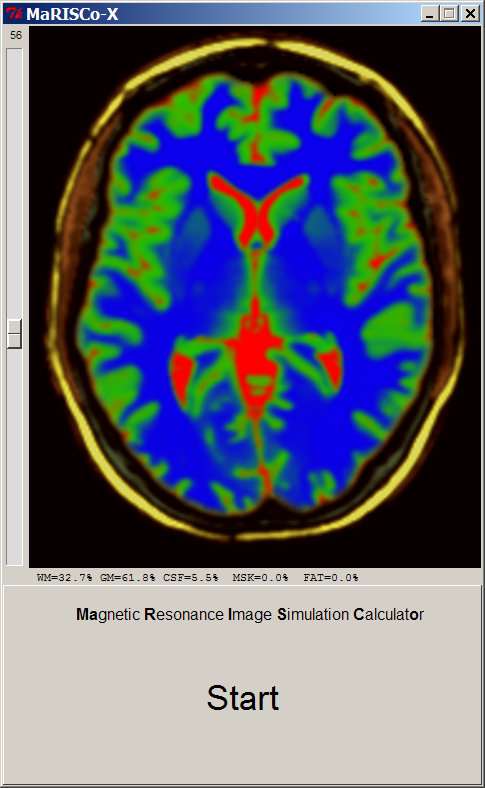

<h1>MaRISCo_Extended</h1>
&emsp; This is based in on the Lite version and additionally includes fat, muscle and bone tissues. 
&emsp; Based on a higher resolution dataset (see notes under the License section below). 
 

<h2>Requirements:</h2>

&emsp; <a href="http://www.python.org">Python</a> which normally already includes <a href="http://wiki.python.org/moin/TkInter">TkInter</a> 
&emsp; and 
<a href="http://www.pythonware.com/products/pil">PIL</a> or it's fork 
<a href="http://python-pillow.org/">pillow</a> 
&emsp; (all included in the standalone distributables). 
 

<h2>Additions:</h2>

&emsp; - includes tissues outside the brain. 
&emsp; - hit the START button on the startup screen. 
&emsp; - permits to investigate WM/GM/CSF/FAT/MSK percentages and normalized signal strength. 
&emsp;&nbsp; (hover with the mouse over the image and observe the information shown beneath) 
 
&emsp;&emsp; 
  

<h2>References, Usage etc.:</h2>
&emsp; see the main <a href="https://github.com/bfoe/MaRISCo">README</a>. 
 
<h2>License:</h2>

&emsp; <a href="http://www.gnu.org/licenses">GPLv3</a> 
 
&emsp; the underlying MR data was derived from the <a href="http://nist.mni.mcgill.ca/?p=947">Colin 27 Average Brain</a> which includes the following license terms: 
&emsp;&emsp; Copyright (C) 1993–2009 Louis Collins, McConnell Brain Imaging Centre, Montreal Neurological Institute, McGill University. 
&emsp;&emsp; Permission to use, copy, modify, and distribute this software and its documentation for any purpose and without fee is 
&emsp;&emsp; hereby granted, provided that the above copyright notice appear in all copies. The authors and McGill University make no 
&emsp;&emsp; representations about the suitability of this software for any purpose. It is provided “as is” without express or implied 
&emsp;&emsp; warranty. The authors are not responsible for any data loss, equipment damage, property loss, or injury to subjects or 
&emsp;&emsp; patients resulting from the use or misuse of this software package. 
 
