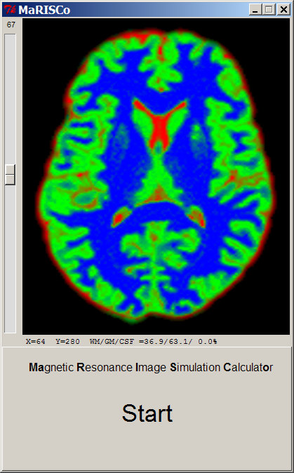

<h1>MaRISCo_Lite</h1>
&emsp; This version has a considerably smaller footprint, to provide small standalone distributables. 
&emsp; However it does not read NIFTI segmentation results, but only the included RGB TIFF image, 
&emsp; in compensation it does not depend on Numpy/NiBabel modules any more. 
 

<h2>Requirements:</h2>

&emsp; <a href="http://www.python.org">Python</a> which normally already includes <a href="http://wiki.python.org/moin/TkInter">TkInter</a> 
&emsp; and 
<a href="http://www.pythonware.com/products/pil">PIL</a> or it's fork 
<a href="http://python-pillow.org/">pillow</a> 
&emsp; (all included in the standalone distributables). 
 

<h2>Additions:</h2>

&emsp; - has a catchy startup screen (hit the START button). 
&emsp; - permits to investigate WM/GM/CSF percentages and normalized signal strength. 
&emsp;&nbsp; (hover with the mouse over the image and observe the information shown beneath) 
 
&emsp;&emsp; 
  

<h2>License, References, Usage etc.:</h2>
&emsp; see the main <a href="https://github.com/bfoe/MaRISCo/README.md">README</a>. 
 
