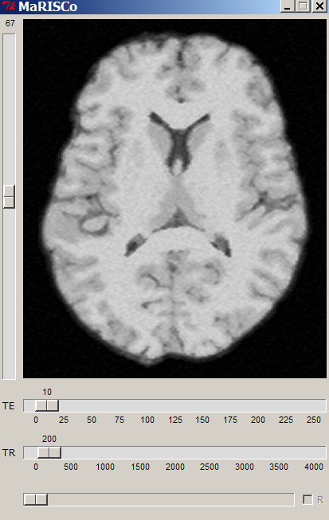
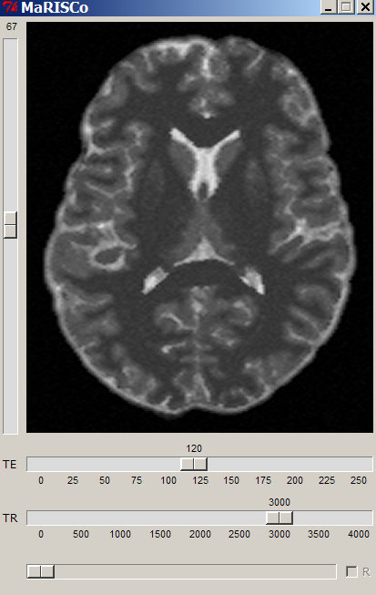
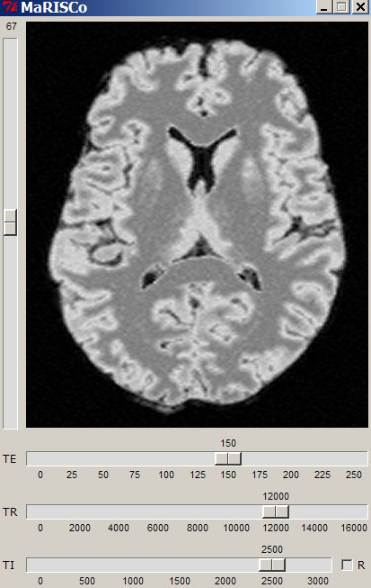
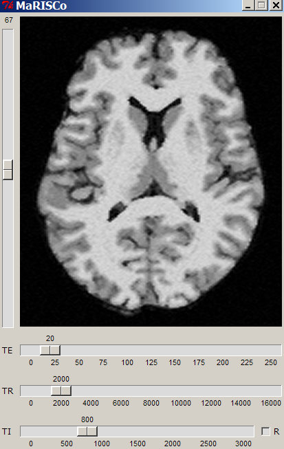
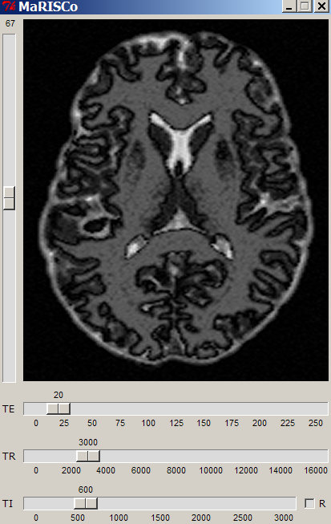
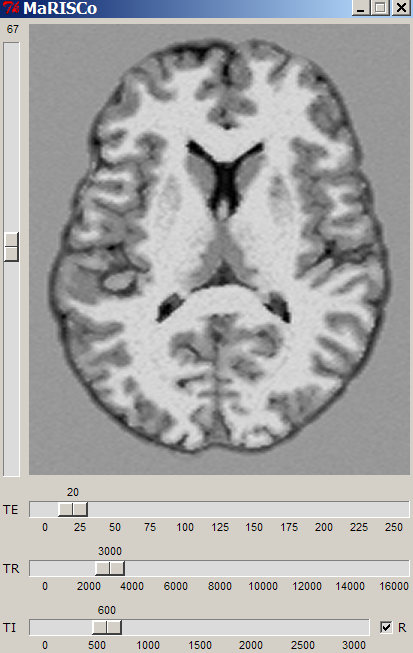

<h1>MaRISCo</h1>

&emsp; <b>Ma</b>gnetic <b>R</b>esonance <b>I</b>mage <b>S</b>imulation <b>C</b>alculat<b>o</b>r 
&emsp; &emsp;&emsp; ( portuguese "marisco" translates to "mussels" or "seafood" ;) 
 

<h2>Purpose:</h2>

&emsp; Interactively calculate a synthetic MR image based on: 
&emsp;&emsp; - previously segmented WM/GM/CSF images (included) 
&emsp;&emsp; - literature values for tissue parameters T1/T2/PD, and 
&emsp;&emsp; - user adjustable sequence parameters TE/TR/TI 
&emsp;&nbsp; Use for educational purposes to demonstrate how the choice of 
&emsp;&nbsp; acquisition parameters influence the image contrast and quality. 
 

<h2>Requirements:</h2>

&emsp; <a href="http://www.python.org">Python</a> which normally already includes <a href="http://wiki.python.org/moin/TkInter">TkInter</a> 
&emsp; plus the additional Python modules 
<a href="http://www.numpy.org">Numpy</a><b>, </b>
<a href="http://nipy.org/nibabel">NiBabel</a>  
&emsp; and 
<a href="http://www.pythonware.com/products/pil">PIL</a> or it's fork 
<a href="http://python-pillow.org/">pillow</a> 
 

<h2>License:</h2>

&emsp; <a href="http://www.gnu.org/licenses">GPLv3</a> 
 

<h2>References:</h2>

&emsp; Tissue parameters: 
&emsp;&emsp;&emsp; <b>G</b>ray <b>M</b>atter &emsp;&emsp; <b>W</b>hite <b>M</b>atter &emsp;&emsp; <b>C</b>erebro<b>S</b>pinal <b>F</b>luid 
&emsp;&emsp;&emsp; T1 = 1034ms &nbsp;&emsp; T1 = 660ms &emsp;&emsp;&nbsp;&nbsp; T1 = 4000ms 
&emsp;&emsp;&emsp; T2 = 93ms &emsp;&emsp;&nbsp;&nbsp; T2 = 73ms  &emsp;&emsp;&emsp; T2 = 2470ms 
&emsp;&emsp;&emsp; PD = 0.78 &emsp;&emsp;&nbsp;&nbsp;&nbsp; PD = 0.65 &emsp;&emsp;&emsp;&nbsp; PD = 0.97 
&emsp;&nbsp; extracted from <a href="http://www.ncbi.nlm.nih.gov/pmc/articles/PMC2822798/">Gasparovic <em>et al</em> J Neurotrauma (2009)</a> 
 
&emsp; Signal equations: 
&emsp;&emsp;&emsp; SE &nbsp;= &nbsp;PD &nbsp; * &nbsp; e -TE/T2 &nbsp; * &nbsp; ( 1 - e -(TR-TE)/T1 ) 
&emsp;&emsp;&emsp; IR &nbsp;&nbsp;= &nbsp; PD &nbsp; * &nbsp; e -TE/T2 &nbsp; * &nbsp; ( 1 - 2e -TI/T1 + e  -(TR-TE)/T1 ) 
&emsp;&nbsp; from Wikipedia: <a href="http://en.wikipedia.org/wiki/Synthetic_MRI">Synthetic MRI</a> 
 
&emsp; Segmented Images: 
&emsp;&emsp; The image displayed was processed based on case #3 of the <a href="http://surfer.nmr.mgh.harvard.edu/fswiki/FsTutorial/Data">FreeSurfer Tutorial Datasets</a>,  
&emsp;&emsp; the complete set of files can be downloaded directly <a href="http://surfer.nmr.mgh.harvard.edu/pub/data/fsfast-tutorial.subjects.tar.gz">here</a> (caution 3.2GB). 
&emsp;&emsp; Segmentation was done with the <a href="http://fsl.fmrib.ox.ac.uk/fsl/fslwiki/FAST">FAST</a> tool from FSLv3
 

<h2>Usage:</h2>

&emsp; By changing the slider positions for TE (echo time) and TR (repetition time) you can 
&emsp; interactively explore the changes in the image contrast.  
&emsp; For example, starting from the initial T1 weighted image at TE/TR = 10/200ms simulate a  
&emsp; T2 weighted image by simply adjusting the sliders to TE/TR = 120/3000ms. 
&emsp; Window and Level (W/L) of the image can be adjusted holding down right mouse button while 
&emsp; moving over the image, a left click resets to the default W/L value. 
 
&emsp;&emsp; 
&emsp;&emsp;  
 
&emsp; If you click on the grayed out slider at the bottom you can switch from a Spin Echo Sequence 
&emsp; to Inversion Recovery and additionally adjust the Inversion time (TI). 
&emsp; You can find (several) conditions where the signal for the Cerebrospinal Fluid (CSF) is nulled, 
&emsp; for example, like in the images below. 
 
&emsp;&emsp; 
&emsp;&emsp;  
 
&emsp; The setting TE/TR/TI = 150/1200/2500ms is a classical FLAIR condition, where FLAIR stands for 
&emsp; "<b>F</b>luid <b>A</b>ttenuated <b>I</b>nversion <b>R</b>ecovery", but you can also find CSF nulled images at around 
&emsp; TE/TR/TI = 20/2000/800ms that exhibit T1 contrast, therefore sometimes called T1-FLAIR. 
 
&emsp; Between these two extreme conditions are images that look somewhat weird, this is because normally 
&emsp; MR images are shown in magnitude mode that does not distinguish between positive and negative signals. 
&emsp; Though, for certain combinations of TI and TR there may be conditions where some signals have positive 
&emsp; signal while others are still negative. 
&emsp; In this case one might like to switch from magnitude images to a mode that permits to distinguish between 
&emsp; positive and negative signals, the resulting images are sometimes called "Real part Images" and that's what the 
&emsp; checkbox bottom-right with the little "R" is for, below two images with identical TE/TR/TI in both modes 
 
&emsp;&emsp; 
&emsp;&emsp;  
 
&emsp; The software adds some random noise to the images such that the simulation gives some impression  
&emsp; how real images could look. 
&emsp; This is by no means (<b>usual disclaimers apply!</b>) a substitute for adjusting real acquisition parameters 
&emsp; on real scanner hardware. But it looks nice, so play around and <b>have fun ;)</b> 

 

<h2>Advanced usage:</h2>

&emsp; You can use your own segmentation results as base for the image simulation: 
&emsp; simply substitute the files "CSF.nii.gz", "GM.nii.gz"and "WM.nii.gz".  
 
&emsp; <b>ATTENTION:</b> For educational/investigational purposes only, not for clinical use! 
&emsp;&emsp;&emsp;&emsp;&emsp;&emsp;&emsp;&nbsp; Simulation does not substitute acquisition of real images!  

 
<h2>Development status:</h2>

&emsp; The MaRISCo sources in the root folder are code locked. 
&emsp; No further improvements will be implemented, no standalone distributables are provided  
&emsp; This version is to quickly visualize segmentation results from different origins (FSL/SPM etc.). 
&emsp; If your intention is purely educational go for one of the following:  
 
&emsp; The MaRISCo_Lite version has a smaller footprint while maintaining the main functionality identical, 
&emsp; for details see the <a href="https://github.com/bfoe/MaRISCo/tree/master/MaRISCo_Lite">README</a>, 
there are standalone distributables for <a href="https://github.com/bfoe/MaRISCo/raw/master/MaRISCo.exe">Windows</a>
and <a href="https://github.com/bfoe/MaRISCo/raw/master/MaRISCo_MacOS.zip">MacOS</a> 
&emsp; This version is basically code locked too. 
 
&emsp; The MaRISCo_Extended version aims to go beyond CSF/GM/WM segmentation, 
&emsp; for details see the <a href="https://github.com/bfoe/MaRISCo/tree/master/MaRISCo_Extended">README</a>, 
standalone distributables for <a href="https://github.com/bfoe/MaRISCo/raw/master/MaRISCo-X.exe">Windows</a>
and <a href="https://github.com/bfoe/MaRISCo/raw/master/MaRISCo-X_MacOS.zip">MacOS</a> coming up ... 
 